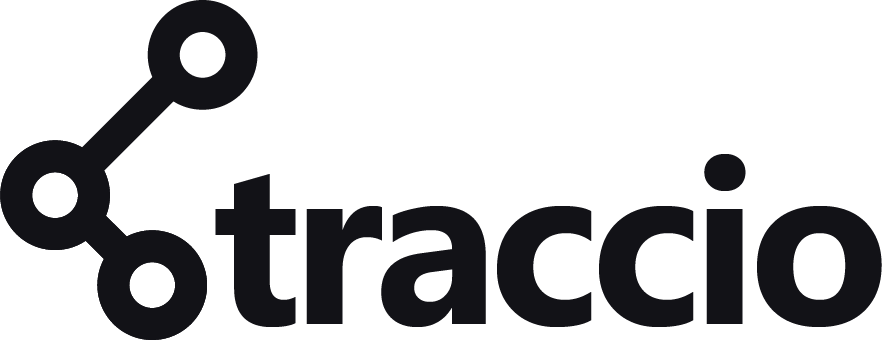

It's job-search tracking, but better!
  

- **[What is *traccio*?](#what-is-traccio)** 
- **[Sneak Peeks!](#sneak-peeks)** 
- **[Libraries/Frameworks](#librariesframeworks)** 
- **[Credits](#credit)** 
- **[License](#license)** 
- **[Support](#support)** 
 

What is *Traccio*?
===

*Traccio* is a simple job hunt tracking application. It allows users to organize their job search endeavors, log in job applications they've submitted, and conveniently track them. It also helps users better monitor their progress, and distill different trends in their job hunts.
 
 

Sneak Peeks!
===

 

 

Libraries/Frameworks
===
*Traccio* is a serverless **Angular 9** web app, with an **AWS** backend setup for authentication and storage. 
Libraries used:
- [Angular Material](https://material.angular.io/) (specific usage details can be found [here](https://github.com/Duha-H/Traccio/wiki/Libraries-Used#angular-material))
- [nivo charts](https://nivo.rocks/)  
  *nivo* is a data-visualization *Reactjs* library, so I had to jump through *some* hoops to use this library in my *Angular* app, but it was one of the main inspirations behind the idea for this app, so I couldn't really compomise on using it. Usage details can be found [here](https://github.com/Duha-H/Traccio/wiki/Libraries-Used#nivo).
- [hammerjs](https://hammerjs.github.io/)  
  For simple mobile swiping gestures utilized in the app. Usage details can be found [here](https://github.com/Duha-H/Traccio/wiki/Libraries-Used#hammerjs).
- [rxjs](https://rxjs.dev/guide/overview) (specific usage details can be found [here](https://github.com/Duha-H/Traccio/wiki/Libraries-Used#rxjs))
- [aws-amplify](https://aws-amplify.github.io/) (specific usage details can be found [here](https://github.com/Duha-H/Traccio/wiki/Libraries-Used#amplify-framework)) 

Backend setup (serverless **AWS** architecture):
- [Cognito](https://aws.amazon.com/cognito/) authentication setup and user pool
- [DynamoDB](https://aws.amazon.com/dynamodb/) database storage
- [GraphQL](https://aws.amazon.com/dynamodb/) API endpoint, created and managed using [AWS AppSync](https://aws.amazon.com/lambda/) 
- [AWS Lambda](https://aws.amazon.com/lambda/) functions were created to handle different aspects of the app's business logic 
Additional setup details can be found [here](https://github.com/Duha-H/Traccio/wiki/Libraries-Used#back-end)

 

Credit
===
Just some specific thanks to cool open-source packages used in the app :star2:
- [nivo](https://nivo.rocks/)
- [hammerjs](https://hammerjs.github.io/)

 

License
===
Licensed under the [MIT License](https://github.com/Duha-H/Traccio/blob/master/LICENSE.md).

Copyright (c) 2020 Duha Hassan

 

Support
===
Enjoying using *Traccio* and feeling generous?

Tips are more than welcome, and help [me](https://github.com/Duha-H) continue to host and maintain Traccio :)

